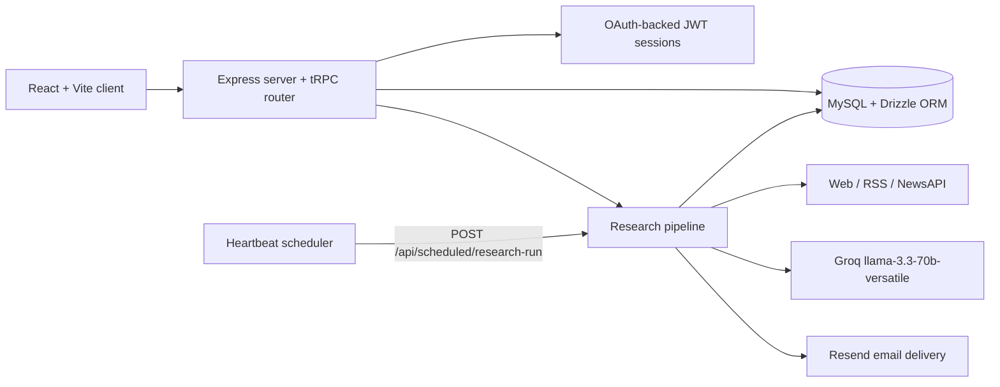

# Intelis-Agent

> A self-running research intelligence workspace that turns scheduled web monitoring into verified, traceable reports.

[](https://github.com/vincenzo-afk/Intelis-Agent/actions/workflows/ci.yml)
[](LICENSE)
[](https://www.typescriptlang.org/)
[](https://react.dev/)
[](https://vitest.dev/)

[Live demo](https://intelis-agent.vercel.app) · [Report a bug](https://github.com/vincenzo-afk/Intelis-Agent/issues/new?template=bug_report.yml) · [Request a feature](https://github.com/vincenzo-afk/Intelis-Agent/issues/new?template=feature_request.yml) · [Changelog](https://github.com/vincenzo-afk/Intelis-Agent/commits/main/)

## <a name="toc"></a>Table of Contents

- [About the Project](#about)
- [Architecture](#architecture)
- [Tech Stack](#stack)
- [Getting Started](#started)
- [Usage](#usage)
- [API Reference](#api)
- [Project Structure](#structure)
- [Features and Roadmap](#features)
- [Testing](#testing)
- [Deployment](#deployment)
- [Contributing](#contributing)
- [Security](#security)
- [License](#license)
- [Acknowledgments](#acknowledgments)
- [References](#references)

---

## <a name="about"></a>About the Project

Intelis-Agent is a full-stack research intelligence application. A user describes a research objective in natural language, selects web, RSS, or NewsAPI sources, and assigns a valid five- or six-field cron expression. The application collects candidate material, fetches and cleans source content, removes duplicates, asks a large language model (LLM) to analyze the supplied material, persists scored findings, and generates reports for the dashboard. Scheduled execution is paired with a manual `Run now` path so the core research flow remains useful even when an external scheduling service is unavailable.

The application is designed around **traceability rather than unsupported synthesis**. Findings retain source URLs, source names, excerpts, confidence-related scores, and verification status. Ask Mode retrieves stored findings and returns answers with citations to the findings used. The database also stores research runs, per-stage state, trends, reports, delivery events, and audit records.

### Key capabilities

- Define research tasks using a natural-language request, optional keywords, topics, source filters, and a cron schedule.
- Collect material from web search, RSS feeds, and NewsAPI when the corresponding source is enabled.
- Process each run through search, crawl, scrape, clean, deduplicate, analyze, summarize, format, and delivery stages.
- Score findings for quality, relevance, credibility, and novelty, while recording `verified`, `partially_verified`, or `unverified` status.
- Track followed companies, people, and topics and persist trend and change events between runs.
- Generate summary, digest, and alert reports and record in-app and email delivery events.
- Ask grounded questions over stored findings and receive source-linked citations.
- Export reports as PDF and research findings as CSV from the client application.

### Screenshots and visual documentation

The repository does not currently contain committed screenshots. The public interface is available through the [live demo](https://intelis-agent.vercel.app). A future contribution may add screenshots under `docs/` with descriptive alt text and reproducible capture instructions.

## <a name="architecture"></a>Architecture



The server entry point is `server/_core/index.ts`. It registers JSON and URL-encoded body parsers, OAuth callback handling, the storage proxy, the cron-only research endpoint, and the tRPC adapter at `/api/trpc`. Development mode uses Vite middleware; production mode serves the built client from the server process.

## <a name="stack"></a>Tech Stack

| Area             | Technology                                               | Version or evidence                                               |
| ---------------- | -------------------------------------------------------- | ----------------------------------------------------------------- |
| Client           | React, React DOM                                         | `19.2.1`                                                          |
| Client tooling   | Vite, Tailwind CSS                                       | `7.1.7`, `4.1.14`                                                 |
| UI               | Radix UI primitives, shadcn/ui conventions, Lucide React | Declared in `package.json`                                        |
| Language         | TypeScript                                               | `5.9.3`                                                           |
| Server           | Express                                                  | `4.21.2`                                                          |
| API              | tRPC client/server, Zod validation                       | `11.6.0`, `4.1.12`                                                |
| Database         | MySQL via `mysql2`, Drizzle ORM and Drizzle Kit          | `3.15.0`, `0.44.5`, `0.31.4`                                      |
| LLM analysis     | Groq OpenAI-compatible chat completions                  | `llama-3.3-70b-versatile` in `server/intelis/groq.ts`             |
| Research sources | Web search, RSS, NewsAPI                                 | Implemented in `server/intelis/sources.ts`                        |
| Email            | Resend                                                   | Used by the notification and pipeline layers                      |
| Object storage   | AWS S3 presigned URLs                                    | `@aws-sdk/client-s3` `3.693.0`                                    |
| Authentication   | OAuth-backed identity plus HS256 JWT session cookies     | Implemented in `server/_core/sdk.ts`                              |
| Client exports   | `pdf-lib` and CSV export utilities                       | `1.17.1` and `client/src/lib/researchExport.ts`                   |
| Tests            | Vitest                                                   | `2.1.4`                                                           |
| Package manager  | pnpm                                                     | Lockfile package manager: `10.4.1`; project dependency: `10.15.1` |

## <a name="started"></a>Getting Started

### Prerequisites

Use a current **Node.js 22** release and [pnpm](https://pnpm.io/installation). The repository’s lockfile and CI workflow use pnpm. Local development also requires a reachable MySQL-compatible database and credentials for the integrations you intend to use.

| Requirement                              | Used for                                                                         | Required when                                  |
| ---------------------------------------- | -------------------------------------------------------------------------------- | ---------------------------------------------- |
| MySQL-compatible database                | Users, tasks, runs, findings, reports, conversations, deliveries, and audit logs | Running the application or database migrations |
| `GROQ_API_KEY`                           | Signal derivation, finding analysis, report generation, retrieval, and Ask Mode  | Creating or processing research tasks          |
| `JWT_SECRET`                             | Signing and verifying session JWTs                                               | Authenticated application use                  |
| `NEWS_API_KEY`                           | NewsAPI source collection                                                        | Using the `news_api` source                    |
| `RESEND_API_KEY` and `RESEND_FROM_EMAIL` | Email report delivery                                                            | Enabling email delivery                        |
| Manus OAuth configuration                | User identity synchronization and platform login                                 | Deploying in the Manus environment             |

### Installation

```bash
git clone https://github.com/vincenzo-afk/Intelis-Agent.git
cd Intelis-Agent
pnpm install
cp .env.example .env
```

Edit `.env` with values for the variables in the configuration table below. Generate a development secret with:

```bash
openssl rand -hex 32
```

Apply the Drizzle migrations using the repository script:

```bash
pnpm db:push
```

### Configuration

The repository includes `.env.example` as a safe template. Do not commit `.env` or real credentials.

<details>
<summary>Environment variable reference</summary>

| Variable                 | Required                         | Description                                                                                   |
| ------------------------ | -------------------------------- | --------------------------------------------------------------------------------------------- |
| `DATABASE_URL`           | Yes for database-backed use      | MySQL connection URL consumed by Drizzle and `mysql2`.                                        |
| `GROQ_API_KEY`           | Required for LLM-backed features | Server-side credential for Groq chat completions.                                             |
| `NEWS_API_KEY`           | Required for NewsAPI             | Credential for the NewsAPI source.                                                            |
| `RESEND_API_KEY`         | Required for email delivery      | Credential for Resend.                                                                        |
| `RESEND_FROM_EMAIL`      | Required for email delivery      | Verified sender address used by Resend.                                                       |
| `JWT_SECRET`             | Required for sessions            | Secret used to sign HS256 session tokens.                                                     |
| `PORT`                   | Optional                         | Preferred server port; defaults to `3000`, then the server searches the next available ports. |
| `NODE_ENV`               | Optional                         | `development` enables Vite middleware; other values use production static serving.            |
| `VITE_APP_ID`            | Manus environment                | Application identifier included in sessions.                                                  |
| `OAUTH_SERVER_URL`       | Manus environment                | OAuth server base URL used for identity synchronization.                                      |
| `OWNER_OPEN_ID`          | Manus environment                | Owner identity used by platform-specific functionality.                                       |
| `BUILT_IN_FORGE_API_URL` | Manus environment                | Platform heartbeat and notification API base URL.                                             |
| `BUILT_IN_FORGE_API_KEY` | Manus environment                | Platform heartbeat and notification credential.                                               |

</details>

### Run locally

```bash
pnpm dev
```

The server reports the selected local URL. The default preferred URL is `http://localhost:3000/`; if that port is occupied, the server checks subsequent ports.

For a production-style local run:

```bash
pnpm build
pnpm start
```

## <a name="usage"></a>Usage

After signing in, create a research task from the dashboard. Provide a name and a natural-language request of at least 12 characters, select at least one source, choose the `scheduled` or `high_throughput` execution profile, and enter a valid five- or six-field cron expression. For example:

```text
Monitor developments in open-weight language models released during the past week, with emphasis on 70B-scale models and benchmark performance.
```

A task may include up to 15 keywords, 10 topics, 20 included source filters, and 20 excluded source filters. The UI can derive keywords and topics through the configured Groq model when they are not supplied explicitly. A task can be run immediately with **Run now**, paused, resumed, updated, or removed.

For questions over accumulated research, open Ask Mode and ask a question such as:

> Which entities appeared across multiple findings, and what evidence supports that pattern?

Ask Mode ranks stored findings, asks the LLM to answer only from the selected records, and returns citation objects containing the finding ID, title, and source URL.

## <a name="api"></a>API Reference

The application exposes a tRPC router at `/api/trpc`. Procedures marked `protectedProcedure` require a valid session. The server accepts the session cookie configured by `COOKIE_NAME` and also supports an `Authorization: Bearer <session-token>` fallback for environments where browser cookies are unavailable.

### tRPC procedures

| Procedure                                          | Access                   | Purpose                                                                 |
| -------------------------------------------------- | ------------------------ | ----------------------------------------------------------------------- |
| `system.health`                                    | Public query             | Returns `{ ok: true }` after validating a non-negative timestamp input. |
| `system.me`                                        | Public query             | Returns the current session identity through the application context.   |
| `system.logout`                                    | Public mutation          | Clears the session cookie.                                              |
| `intelligence.dashboard`                           | Protected query          | Returns dashboard metrics, tasks, findings, runs, and trends.           |
| `intelligence.tasks.list`                          | Protected query          | Lists the caller’s research tasks.                                      |
| `intelligence.tasks.activity`                      | Protected query          | Lists active task runs.                                                 |
| `intelligence.tasks.create`                        | Protected mutation       | Creates and optionally schedules a research task.                       |
| `intelligence.tasks.update`                        | Protected mutation       | Updates task values and synchronizes an existing scheduled job.         |
| `intelligence.tasks.remove`                        | Protected mutation       | Deletes an owned task and its scheduled job when present.               |
| `intelligence.tasks.activateSchedule`              | Protected mutation       | Creates or enables the production scheduler job.                        |
| `intelligence.tasks.pause` / `resume`              | Protected mutation       | Pauses or resumes a task and its scheduler job.                         |
| `intelligence.tasks.runNow`                        | Protected mutation       | Runs the research pipeline immediately.                                 |
| `intelligence.collections.list` / `create`         | Protected query/mutation | Lists or creates research collections.                                  |
| `intelligence.entities.list` / `create` / `toggle` | Protected query/mutation | Manages followed companies, people, and topics.                         |
| `intelligence.reports.list`                        | Protected query          | Lists the most recent reports owned by the caller.                      |
| `intelligence.ask.query`                           | Protected mutation       | Answers a question over stored findings and returns citations.          |

### Scheduled research endpoint

`POST /api/scheduled/research-run` is not a browser-facing trigger. It authenticates the request, requires a cron identity with a task UID, looks up the associated task, and returns HTTP `403` for non-cron callers. Inactive or orphaned jobs return a successful skipped response rather than starting a run.

```bash
curl -X POST https://your-host.example/api/scheduled/research-run \
  -H 'Authorization: Bearer <scheduler-session-token>' \
  -H 'Content-Type: application/json'
```

The scheduler token is deployment-specific and must never be committed to the repository or exposed in client-side code.

## <a name="structure"></a>Project Structure

<details>
<summary>Expand the source tree</summary>

```text
Intelis-Agent/
├── client/
│   ├── public/
│   └── src/                 # React pages, components, styles, exports, and tests
├── server/
│   ├── _core/               # Express bootstrap, tRPC context, auth, storage, Vite, and platform adapters
│   ├── intelis/              # Sources, Groq analysis, pipeline, scheduling, repository, and validators
│   ├── routers/              # tRPC feature routers
│   └── *.test.ts             # Server tests
├── shared/                   # Types and constants shared by client and server
├── drizzle/                 # Drizzle schema, migration SQL, and migration metadata
├── patches/                 # pnpm patched dependency sources
├── index.ts                 # Root host entry that imports the Express bootstrap
├── package.json              # Scripts, dependencies, and pnpm configuration
├── pnpm-lock.yaml            # Locked dependency graph
├── tsconfig.json             # TypeScript compiler configuration
├── vite.config.ts            # Client build and Vite integration
├── vitest.config.ts          # Test configuration
└── vercel.json               # Static asset cache header configuration
```

</details>

The persisted model includes users, collections, research tasks, followed entities, entity change events, research runs, findings, source snapshots, trends, reports, Ask Mode conversations and messages, delivery events, and audit logs. See `drizzle/schema.ts` for the source of truth.

## <a name="features"></a>Features and Roadmap

### Implemented

- Natural-language task definition with optional LLM-derived keywords and topics.
- Web, RSS, and NewsAPI source collection with source filtering and validation.
- Persisted pipeline stages, run status, source counts, finding counts, and errors.
- Finding analysis with quality, relevance, credibility, and novelty scores.
- Verification status and source-linked evidence records.
- Scheduled task lifecycle with manual execution and graceful `needs_activation` fallback when a platform scheduler is unavailable.
- Summary, digest, and alert report records with in-app and email delivery tracking.
- Entity following, change events, trends, collections, dashboard metrics, Ask Mode, PDF export, CSV export, task filtering, and theme preferences.

### Known limitations and roadmap

The application’s production scheduling path depends on a heartbeat service when deployed to the Manus environment. On third-party hosts, task creation can succeed without an attached scheduler and return `needs_activation`; manual runs continue to work, but a deployment-specific scheduler integration is required for autonomous execution. The repository does not currently include Slack or generic webhook delivery, public report sharing, or a Docker deployment definition.

## <a name="testing"></a>Testing

Run the type checker and Vitest suite with the project’s exact scripts:

```bash
pnpm check
pnpm test
```

The test suite covers client export, filtering, timing, and theme utilities; authentication logout; source collection; input contracts and validators; Groq behavior; pipeline progress and email delivery; provider credential checks; and intelligence task controls. Credential-dependent tests are present in `server/groq.credentials.test.ts` and `server/providers.credentials.test.ts`; provide the relevant integration variables only when you intentionally want to exercise live provider checks.

Formatting is available through:

```bash
pnpm format
```

The repository’s continuous integration workflow runs dependency installation, TypeScript checking, the test suite, and the production build on Node.js 22.

## <a name="deployment"></a>Deployment

### Vercel

The repository includes `vercel.json` with a long-cache header for `/assets/(.*)`. It does not declare environment values, database provisioning, a cron job, or a custom Vercel function. Configure the project’s build and runtime behavior in the deployment platform according to your hosting setup, then provide the required environment variables through the platform’s secret manager.

Because the application relies on a long-running Express-style server process and an external scheduler for autonomous research, verify the chosen Vercel runtime and scheduled invocation model before treating a Vercel deployment as a complete autonomous deployment. Manual task execution remains the safest validation path for a third-party host.

### Self-hosted Node.js

```bash
pnpm install --frozen-lockfile
pnpm db:push
pnpm build
NODE_ENV=production pnpm start
```

Set `DATABASE_URL`, `GROQ_API_KEY`, `JWT_SECRET`, and any optional integration variables before starting the server. Use an external scheduler that can authenticate to `/api/scheduled/research-run` if you need autonomous runs outside the Manus heartbeat environment. Do not expose scheduler credentials to the browser.

## <a name="contributing"></a>Contributing

Contributions are welcome. Read [CONTRIBUTING.md](CONTRIBUTING.md) before opening a pull request. The expected workflow is to create a focused branch, install with pnpm, make the smallest coherent change, run `pnpm check`, `pnpm test`, and `pnpm build`, and explain the behavior change in the pull request. Use the provided issue forms for bug reports and feature proposals.

Please do not include credentials, session tokens, private source material, generated build output, or production database data in commits, tests, screenshots, or issue reports. Review the [security policy](SECURITY.md) for vulnerability reports.

## <a name="security"></a>Security

The server keeps provider credentials server-side, validates tRPC inputs with Zod, checks task ownership before mutations, authenticates sessions with signed JWTs, and distinguishes cron identities from regular users. The scheduled research endpoint rejects non-cron callers with HTTP `403`. These controls reduce common failure modes but do not make arbitrary scraped content trustworthy; the LLM prompts explicitly treat source material as untrusted reference text.

Report vulnerabilities privately through the [security advisory form](https://github.com/vincenzo-afk/Intelis-Agent/security/advisories/new) when available. If private advisories are unavailable for the repository, contact the maintainer through the [vincenzo-afk GitHub profile](https://github.com/vincenzo-afk) and avoid posting exploit details in a public issue. See [SECURITY.md](SECURITY.md) for the reporting policy.

## <a name="license"></a>License

Intelis-Agent is distributed under the [MIT License](LICENSE). The repository license notice attributes copyright to **BHARANI KUMAR S**.

## <a name="acknowledgments"></a>Acknowledgments

The project uses [React](https://react.dev/), [Vite](https://vite.dev/), [Express](https://expressjs.com/), [tRPC](https://trpc.io/), [Drizzle ORM](https://orm.drizzle.team/), [Groq](https://groq.com/), [Resend](https://resend.com/), [NewsAPI](https://newsapi.org/), [AWS SDK for JavaScript](https://aws.amazon.com/sdk-for-javascript/), [Radix UI](https://www.radix-ui.com/), and [Vitest](https://vitest.dev/). Their licenses and terms remain the responsibility of their respective projects.

## <a name="references"></a>References

[1]: https://pnpm.io/installation "pnpm installation documentation"
[2]: https://docs.github.com/en/actions "GitHub Actions documentation"
[3]: https://orm.drizzle.team/docs/kit-overview "Drizzle Kit documentation"
[4]: https://trpc.io/docs "tRPC documentation"

---

<p align="center"><a href="#toc">Back to top</a> · <a href="https://github.com/vincenzo-afk/Intelis-Agent">GitHub repository</a> · <a href="https://github.com/vincenzo-afk">Maintainer profile</a></p>
