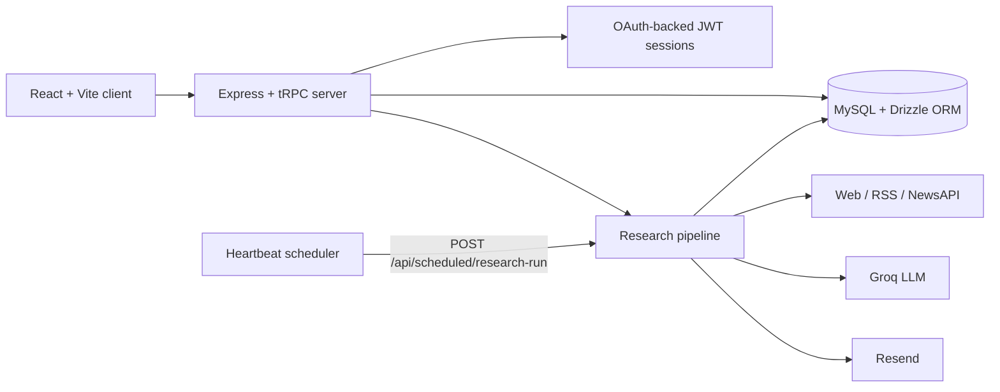

# Intelis-Agent

> A self-running research agent that monitors the web on a schedule, verifies findings with LLM analysis, and delivers intelligence reports by email and in-app.

[](https://github.com/vincenzo-afk/Intelis-Agent/actions/workflows/ci.yml)
[](LICENSE)
[](https://www.typescriptlang.org/)
[](https://react.dev/)
[](https://vitest.dev/)

[Live demo](https://intelis-agent.vercel.app) · [Report a bug](https://github.com/vincenzo-afk/Intelis-Agent/issues/new?template=bug_report.yml) · [Request a feature](https://github.com/vincenzo-afk/Intelis-Agent/issues/new?template=feature_request.yml) · [Changelog](https://github.com/vincenzo-afk/Intelis-Agent/commits/main/)

## <a name="toc"></a>Table of Contents

- [About Intelis-Agent](#about)
- [Architecture](#architecture)
- [Tech Stack](#stack)
- [Getting Started](#started)
- [Usage](#usage)
- [API Reference](#api)
- [Project Structure](#structure)
- [Features and Limitations](#features)
- [Testing](#testing)
- [Deployment](#deployment)
- [Contributing](#contributing)
- [Security](#security)
- [License](#license)
- [Acknowledgments](#acknowledgments)
- [References](#references)

---

## <a name="about"></a>About Intelis-Agent

Intelis-Agent is a full-stack research application. A user describes a research objective in natural language, selects one or more implemented sources, and configures a five- or six-field cron expression. The server stores the task, collects candidate material, processes the research pipeline, persists findings and run state, and creates intelligence reports.

The application is built around traceable findings. Each finding can retain its source URL, source name, excerpt, summary, quality score, relevance score, credibility score, novelty score, and verification status. Ask Mode queries stored findings and returns citations for the records used in the answer.

### Implemented capabilities

- Natural-language research tasks with optional keywords, topics, filters, source selection, and scheduled execution.
- Web, RSS, and NewsAPI source collection implemented in `server/intelis/sources.ts`.
- LLM-backed task-signal derivation, finding analysis, report synthesis, semantic retrieval, and Ask Mode through Groq’s `llama-3.3-70b-versatile` model.
- Persisted research runs, stage state, findings, source snapshots, trends, reports, delivery events, and audit logs.
- Manual `Run now` execution, task pause/resume controls, and scheduler activation handling.
- Summary, digest, and alert reports with in-app notifications and optional Resend email delivery.
- Followed entities for companies, people, and topics, with change events and trend analysis.
- Client-side PDF and CSV export utilities, task filtering, collections, and theme preferences.

## <a name="architecture"></a>Architecture



The application entry point is `server/_core/index.ts`. It registers the Express body parsers, OAuth callback, storage proxy, scheduled research endpoint, and tRPC router at `/api/trpc`. Development mode uses Vite middleware. Production mode serves the client build from the server process.

## <a name="stack"></a>Tech Stack

| Area             | Technology                                            | Version or source                     |
| ---------------- | ----------------------------------------------------- | ------------------------------------- |
| Frontend         | React and React DOM                                   | `19.2.1`                              |
| Frontend tooling | Vite                                                  | `7.1.7`                               |
| Styling          | Tailwind CSS                                          | `4.1.14`                              |
| Language         | TypeScript                                            | `5.9.3`                               |
| Server           | Express                                               | `4.21.2`                              |
| API              | tRPC                                                  | `11.6.0`                              |
| Validation       | Zod                                                   | `4.1.12`                              |
| Database         | MySQL through `mysql2`; Drizzle ORM                   | `3.15.0`; `0.44.5`                    |
| LLM provider     | Groq chat completions                                 | `llama-3.3-70b-versatile`             |
| Sources          | Web search, RSS, NewsAPI                              | `server/intelis/sources.ts`           |
| Email            | Resend                                                | Pipeline and notification integration |
| Storage          | AWS S3 presigned URLs                                 | `@aws-sdk/client-s3` `3.693.0`        |
| Authentication   | OAuth identity synchronization and HS256 JWT sessions | `server/_core/sdk.ts`                 |
| Testing          | Vitest                                                | `2.1.4`                               |
| Package manager  | pnpm                                                  | `10.4.1` from `package.json`          |

## <a name="started"></a>Getting Started

### Prerequisites

Use Node.js 22 and pnpm. Node.js 22 is the runtime validated by the repository’s CI workflow. Local development also requires a reachable MySQL-compatible database and credentials for the integrations used by your environment.

| Requirement                              | Purpose                                                                                     |
| ---------------------------------------- | ------------------------------------------------------------------------------------------- |
| MySQL-compatible database                | Stores users, tasks, runs, findings, reports, conversations, deliveries, and audit records. |
| `DATABASE_URL`                           | Database connection URL.                                                                    |
| `JWT_SECRET`                             | Session signing and verification.                                                           |
| `GROQ_API_KEY`                           | LLM-backed task analysis, finding analysis, reports, retrieval, and Ask Mode.               |
| `NEWS_API_KEY`                           | NewsAPI source collection.                                                                  |
| `RESEND_API_KEY` and `RESEND_FROM_EMAIL` | Optional email report delivery.                                                             |
| Manus platform variables                 | OAuth, heartbeat, and owner-notification integration in that hosting environment.           |

### Installation

```bash
git clone https://github.com/vincenzo-afk/Intelis-Agent.git
cd Intelis-Agent
pnpm install
cp .env.example .env
```

Generate a development secret with:

```bash
openssl rand -hex 32
```

Apply the database migrations with the repository’s script:

```bash
pnpm db:push
```

### Configuration

The complete template is in `.env.example`. Never commit `.env`, session tokens, API keys, or database credentials.

<details>
<summary>Environment variables</summary>

| Variable                    | Required                       | Description                                                                          |
| --------------------------- | ------------------------------ | ------------------------------------------------------------------------------------ |
| `DATABASE_URL`              | Yes for database-backed use    | MySQL connection URL consumed by Drizzle.                                            |
| `JWT_SECRET`                | Yes for authenticated use      | Secret used to sign HS256 session tokens.                                            |
| `GROQ_API_KEY`              | For LLM-backed features        | Server-side Groq credential.                                                         |
| `NEWS_API_KEY`              | For NewsAPI source use         | NewsAPI credential.                                                                  |
| `RESEND_API_KEY`            | For email delivery             | Resend credential.                                                                   |
| `RESEND_FROM_EMAIL`         | For email delivery             | Verified sender address for Resend.                                                  |
| `PORT`                      | Optional                       | Preferred server port; defaults to `3000` and searches subsequent ports if occupied. |
| `NODE_ENV`                  | Optional                       | `development` enables Vite middleware; production mode serves static files.          |
| `VITE_APP_ID`               | Manus environment              | Application identifier used by the platform identity flow.                           |
| `OAUTH_SERVER_URL`          | Manus environment              | OAuth server base URL.                                                               |
| `OWNER_OPEN_ID`             | Manus environment              | Platform owner identity.                                                             |
| `BUILT_IN_FORGE_API_URL`    | Manus environment              | Platform heartbeat and notification API URL.                                         |
| `BUILT_IN_FORGE_API_KEY`    | Manus environment              | Platform heartbeat and notification API key.                                         |
| `VITE_ANALYTICS_ENDPOINT`   | Optional client template value | Analytics script base URL referenced by `client/index.html`.                         |
| `VITE_ANALYTICS_WEBSITE_ID` | Optional client template value | Analytics website identifier referenced by `client/index.html`.                      |

</details>

### Run locally

```bash
pnpm dev
```

The server prefers `http://localhost:3000/`. If that port is occupied, it checks the next available ports.

For a production-style local run:

```bash
pnpm build
pnpm start
```

## <a name="usage"></a>Usage

After authentication, create a research task from the dashboard. The task input supports a name, a natural-language request, at least one source, optional keywords and topics, source filters, a cron expression, an execution profile, and optional email delivery.

A research request can be written in plain language, for example:

```text
Monitor changes in open-weight language models released during the past week, focusing on benchmark performance and model size.
```

The task router validates the request with Zod. It accepts `web`, `rss`, and `news_api` sources; `scheduled` and `high_throughput` execution profiles; and five- or six-field cron expressions. Tasks can be run immediately, paused, resumed, updated, or removed.

Ask Mode answers questions from stored findings rather than from an unrestricted prompt. Responses include citations containing the finding ID, title, and source URL.

## <a name="api"></a>API Reference

The API is a tRPC router mounted at `/api/trpc`. Protected procedures require a valid authenticated session. The server accepts the session cookie and an `Authorization: Bearer` fallback for environments where cookies are unavailable.

### tRPC procedures

| Procedure                                          | Access                   | Purpose                                                               |
| -------------------------------------------------- | ------------------------ | --------------------------------------------------------------------- |
| `system.health`                                    | Public query             | Validates a timestamp input and returns `{ ok: true }`.               |
| `system.me`                                        | Public query             | Returns the current session identity through the application context. |
| `system.logout`                                    | Public mutation          | Clears the session cookie.                                            |
| `intelligence.dashboard`                           | Protected query          | Returns dashboard metrics, tasks, findings, runs, and trends.         |
| `intelligence.tasks.list` / `activity`             | Protected query          | Lists tasks or active task runs owned by the caller.                  |
| `intelligence.tasks.create` / `update` / `remove`  | Protected mutation       | Creates, updates, or removes owned research tasks.                    |
| `intelligence.tasks.activateSchedule`              | Protected mutation       | Creates or enables the production scheduler job.                      |
| `intelligence.tasks.pause` / `resume`              | Protected mutation       | Pauses or resumes a task and its scheduler job.                       |
| `intelligence.tasks.runNow`                        | Protected mutation       | Runs the research pipeline immediately.                               |
| `intelligence.collections.list` / `create`         | Protected query/mutation | Lists or creates research collections.                                |
| `intelligence.entities.list` / `create` / `toggle` | Protected query/mutation | Manages followed companies, people, and topics.                       |
| `intelligence.reports.list`                        | Protected query          | Lists recent reports owned by the caller.                             |
| `intelligence.ask.query`                           | Protected mutation       | Answers a question over stored findings and returns citations.        |

### Scheduled research endpoint

`POST /api/scheduled/research-run` is reserved for authenticated scheduler callbacks. The handler requires a cron identity and task UID, returns `403` to non-cron callers, skips inactive or orphaned tasks, and starts the research pipeline for valid scheduled tasks.

The scheduler credential is deployment-specific. Keep it in the hosting platform’s secret manager and never expose it in client code.

## <a name="structure"></a>Project Structure

<details>
<summary>Expand the source tree</summary>

```text
Intelis-Agent/
├── client/                 # React client, pages, components, styles, and exports
├── server/
│   ├── _core/              # Express bootstrap, auth, tRPC, storage, Vite, and platform adapters
│   ├── intelis/             # Sources, Groq analysis, pipeline, scheduling, repository, and validators
│   ├── routers/             # tRPC feature routers
│   └── *.test.ts            # Server tests
├── shared/                  # Types and constants shared by client and server
├── drizzle/                # Drizzle schema and SQL migrations
├── patches/                # pnpm patched dependency sources
├── index.ts                 # Root host entry that imports the Express bootstrap
├── package.json             # Scripts and dependency declarations
├── pnpm-lock.yaml           # Locked dependency graph
├── tsconfig.json            # TypeScript configuration
├── vite.config.ts           # Client build configuration
├── vitest.config.ts         # Test configuration
└── vercel.json              # Static asset cache header configuration
```

</details>

The main persisted entities are defined in `drizzle/schema.ts`: users, collections, research tasks, followed entities, change events, runs, findings, source snapshots, trends, reports, Ask Mode conversations and messages, delivery events, and audit logs.

## <a name="features"></a>Features and Limitations

### Implemented

- Scheduled and manual research task execution.
- Web, RSS, and NewsAPI collection.
- LLM-based signal derivation, analysis, summarization, semantic retrieval, and grounded answers.
- Persisted run progress, findings, scores, verification status, reports, trends, and delivery events.
- In-app notifications and optional Resend email delivery.
- PDF and CSV export utilities.
- Task, collection, entity, dashboard, and theme interfaces.

### Current limitations

The repository does not contain a Dockerfile or Docker Compose configuration. The `vercel.json` file defines an asset-cache header but does not provision a database, environment variables, or a scheduler. On hosts without the Manus heartbeat service, tasks may require deployment-specific scheduler integration for autonomous execution; manual runs remain available.

## <a name="testing"></a>Testing

Run the checked-in scripts:

```bash
pnpm check
pnpm test
pnpm build
```

The suite uses Vitest and covers client utilities, authentication logout, source collection, contracts, validators, Groq behavior, pipeline progress, email delivery, provider credentials, and intelligence task controls. The default run contains 29 tests; the live Groq, NewsAPI, and Resend checks are skipped when their credentials are not present.

Formatting is available with:

```bash
pnpm format
```

The GitHub Actions workflow runs dependency installation, `pnpm check`, `pnpm test`, and `pnpm build` in a `Validate` job on Node.js 22.

## <a name="deployment"></a>Deployment

### Self-hosted Node.js

```bash
pnpm install --frozen-lockfile
pnpm db:push
pnpm build
NODE_ENV=production pnpm start
```

Set the required environment variables before starting the server. Add an external scheduler that can authenticate to `/api/scheduled/research-run` when scheduled research is needed outside the Manus heartbeat environment.

### Vercel

The repository contains `vercel.json` with a long-cache header for `/assets/(.*)`. It does not declare builds, functions, routes, database provisioning, or cron configuration. Verify the selected Vercel runtime and scheduling model before treating a deployment as fully autonomous.

## <a name="contributing"></a>Contributing

Read [CONTRIBUTING.md](CONTRIBUTING.md) before opening a pull request. The normal workflow is:

```bash
pnpm install
pnpm check
pnpm test
pnpm build
```

Keep changes focused, preserve server-side secret handling, update documentation when behavior changes, and do not commit `.env` files, tokens, private research material, production data, or generated build output. Use the issue forms and pull-request template in `.github/`.

## <a name="security"></a>Security

The application signs and verifies session JWTs, validates tRPC inputs with Zod, checks task ownership before protected mutations, separates cron identities from regular users, and keeps provider credentials on the server. The scheduled endpoint rejects non-cron callers with HTTP `403`. Research-source content is treated as untrusted reference material by the LLM prompts.

Report vulnerabilities privately through the [GitHub security advisory form](https://github.com/vincenzo-afk/Intelis-Agent/security/advisories/new) when available. If private advisories are unavailable, contact the maintainer through the [repository owner’s GitHub profile](https://github.com/vincenzo-afk) without posting exploit details publicly. See [SECURITY.md](SECURITY.md).

## <a name="license"></a>License

Intelis-Agent is licensed under the [MIT License](LICENSE).

## <a name="acknowledgments"></a>Acknowledgments

Intelis-Agent uses open-source libraries and services including React, Vite, Express, tRPC, Drizzle ORM, Groq, Resend, NewsAPI, the AWS SDK for JavaScript, Radix UI, and Vitest. See `package.json` and the lockfile for the dependency sources and versions.

## <a name="references"></a>References

[1]: https://pnpm.io/installation "pnpm installation documentation"
[2]: https://docs.github.com/en/actions "GitHub Actions documentation"
[3]: https://orm.drizzle.team/docs/kit-overview "Drizzle Kit documentation"
[4]: https://trpc.io/docs "tRPC documentation"

---

<p align="center"><a href="#toc">Back to top</a> · <a href="https://github.com/vincenzo-afk/Intelis-Agent">Intelis-Agent on GitHub</a></p>
