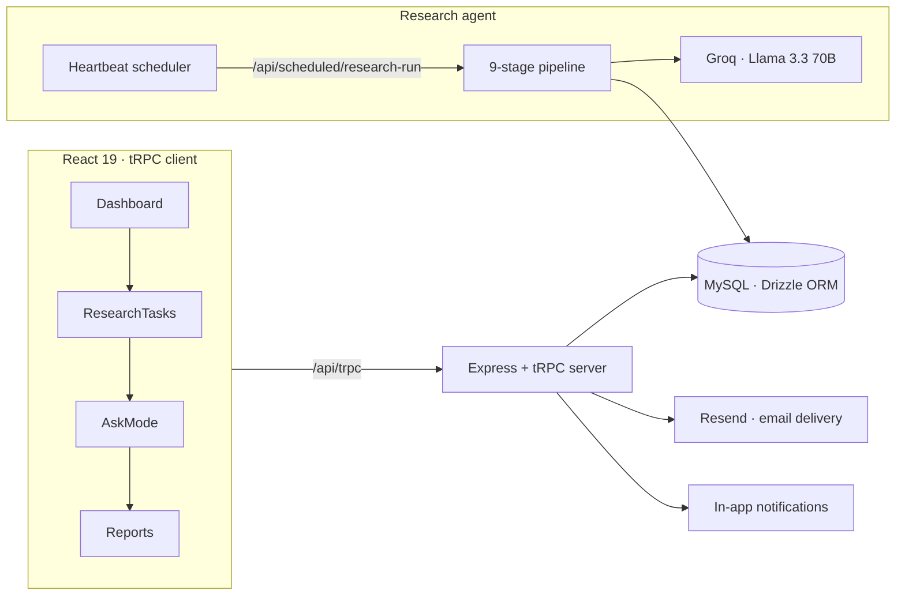

<div align="center">

```
 _____ _      _        _ _ _       _
|_   _| |    (_)_ __  (_) (_) __ _| |_
  | | | |    | | '_ \| | | |/ _` | __|
  | | | |___ | | | | | | | | (_| | |_
  |_| |_____||_|_| |_|_|_|_|\__,_|\__|

          A G E N T   I N T E L L I G E N C E
```

# Intelis-Agent

**A self-running research agent that monitors the web on your schedule, verifies what it finds, and delivers intelligence reports before you even ask.**

[](https://github.com/vincenzo-afk/Intelis-Agent/blob/main/LICENSE)
[](https://pnpm.io)
[](https://www.typescriptlang.org)
[](https://react.dev)
[](https://trpc.io)
[](https://github.com/vincenzo-afk/Intelis-Agent/actions)

[Live demo ↗](https://intelis-agent.vercel.app) · [Report a bug ↗](https://github.com/vincenzo-afk/Intelis-Agent/issues/new) · [Request a feature ↗](https://github.com/vincenzo-afk/Intelis-Agent/issues/new)

</div>

---

## <a name="toc"></a>Table of Contents

- [About the Project](#about)
- [Architecture](#architecture)
- [Tech Stack](#stack)
- [Getting Started](#started)
- [Usage](#usage)
- [API Reference](#api)
- [Project Structure](#structure)
- [Features & Roadmap](#features)
- [Testing](#testing)
- [Deployment](#deployment)
- [Contributing](#contributing)
- [Security](#security)
- [License](#license)
- [Acknowledgments](#acknowledgments)

---

## <a name="about"></a>About the Project

Intelis is a full-stack research agent. Instead of opening a dozen tabs and pasting findings into a document, you describe what you want monitored in plain English, set a schedule, and walk away. On every tick of the clock, Intelis searches the web, RSS feeds, and news APIs, crawls and scrapes the candidate pages, runs the gathered text through Groq's Llama 3.3 70B for extraction and verification, scores each finding for quality and credibility, and assembles formatted **summary**, **digest**, and **alert** reports. Reports are delivered to the dashboard and, where digest or alert content is flagged important, emailed to your inbox — with an in-app notification confirming the handover either way.

Where many scraping tools stop at "here's a pile of links," Intelis answers three harder questions: *Is this finding actually relevant and credible?* (each finding is scored on quality, relevance, and credibility), *What is changing over time?* (monitored entities are tracked across runs and surfaced as trends), and *What does the accumulated record say?* (Ask Mode lets you question everything the agent has collected, with every answer grounded in cited evidence).

**What it does, concretely:**

- **Natural-language task definition** — describe a research goal in a sentence; Intelis derives keywords, topics, and source filters automatically.
- **Nine-stage pipeline** — search → crawl → scrape → clean → deduplicate → verify → summarize → format → deliver, with live per-stage progress persisted to the database.
- **Scheduled execution** — cron-driven runs (down to per-minute granularity), with manual "Run now" as the escape hatch.
- **On-time delivery** — completed runs notify you in-app; digest and alert reports are emailed through Resend with retry handling, and every delivery event is logged with its status.
- **Entity tracking and trends** — follow monitored entities; the agent detects and records how they change between runs.
- **Ask Mode** — a grounded chat over your accumulated findings; answers are constrained to collected evidence and cite their sources.
- **Experiments in portability** — every report and the full research base can be exported as **PDF** or **CSV**.

## <a name="architecture"></a>Architecture



A single Express server hosts the tRPC API, the static client build, and the pipeline. Scheduled runs arrive through a cron-only-authenticated endpoint (`/api/scheduled/research-run`), which enforces that only the platform scheduler — never a browser session — can trigger autonomous research.

---

## <a name="stack"></a>Tech Stack

| Layer | Technology | Version |
|---|---|---|
| Frontend | React, React DOM | 19.2.1 |
| Frontend | Vite | 7.1.7 |
| Frontend | Tailwind CSS | 4.1.14 |
| Frontend | UI components (Radix + shadcn) | — |
| Frontend | TypeScript | 5.9.3 |
| Backend | Express | 4.21.2 |
| API | tRPC (client + server) | 11.6.0 |
| API | Zod (input validation) | 4.1.12 |
| Database | MySQL via mysql2, ORM via Drizzle | 3.15.0 / 0.44.5 |
| AI | Groq API — `llama-3.3-70b-versatile` | — |
| Data sources | NewsAPI, RSS, direct web search/crawl | — |
| Email | Resend | — |
| Storage | AWS S3 (presigned URLs via `@aws-sdk`) | 3.693.0 |
| Auth | jose (JWT), session cookies | 6.1.0 |
| Exports | pdf-lib (client-side PDF) | 1.17.1 |
| Package manager | pnpm | 10.15.1 |
| Testing | Vitest | 2.1.4 |

---

## <a name="started"></a>Getting Started

### Prerequisites

You need [Node.js](https://nodejs.org) 22 or later and [pnpm](https://pnpm.io) installed. You will also need accounts and API keys for the services below; none of them are billed at hobby scale except where noted.

| Requirement | Purpose | Where to get it |
|---|---|---|
| MySQL database | Persists tasks, findings, reports, delivery events | PlanetScale, Aiven, Railway, or self-hosted |
| `GROQ_API_KEY` | LLM extraction, verification, summarization | [console.groq.com](https://console.groq.com) |
| `RESEND_API_KEY` + `RESEND_FROM_EMAIL` | Emailing digest and alert reports | [resend.com](https://resend.com) |
| `NEWS_API_KEY` | News headlines as a research source | [newsapi.org](https://newsapi.org) |
| `JWT_SECRET` | Session security — generate a random string | `openssl rand -hex 32` |

### Installation

```bash
git clone https://github.com/vincenzo-afk/Intelis-Agent.git
cd Intelis-Agent
pnpm install
```

Copy the environment template and fill in the values described below:

```bash
cp .env.example .env
```

### Configuration

Every environment variable the server reads, and what each one controls:

<details>
<summary>Full environment variable reference</summary>

| Variable | Required | Purpose |
|---|---|---|
| `DATABASE_URL` | Yes | MySQL connection string used by Drizzle |
| `GROQ_API_KEY` | Yes | Authenticates Groq LLM calls (`llama-3.3-70b-versatile`) |
| `RESEND_API_KEY` | For email delivery | Sends digest/alert report emails |
| `RESEND_FROM_EMAIL` | For email delivery | Sender address for report emails |
| `NEWS_API_KEY` | For news sources | Authenticates NewsAPI source collection |
| `JWT_SECRET` | Yes | Signs session JWTs; never share it |
| `PORT` | No | Server listen port (default `3000`) |
| `NODE_ENV` | No | `development` uses Vite dev server; `production` serves the built client |
| `BUILT_IN_FORGE_API_URL` / `BUILT_IN_FORGE_API_KEY` | On Manus hosting only | Platform heartbeat (cron) and owner notifications. On Vercel or self-hosted deployments these are optional — the app degrades gracefully to manual runs. |
| `OAUTH_SERVER_URL`, `OWNER_OPEN_ID`, `VITE_APP_ID` | On Manus hosting only | Platform OAuth identity wiring |

</details>

### Running

```bash
# Development (Vite HMR + tsx watch)
NODE_ENV=development npx tsx watch server/_core/index.ts

# Production build and start
pnpm build
NODE_ENV=production node dist/index.js
```

After the server starts, apply the schema to your database:

```bash
npx drizzle-kit push
```

---

## <a name="usage"></a>Usage

### 1. Create a research task

From the dashboard, open the task composer and write what you care about — no query syntax required.

```
Monitor developments in open-weight language models released in the past week,
with a focus on 70B-scale models and their benchmark performance.
```

Intelis derives keywords, topics, and filters from the sentence, proposes sources (web search, RSS, NewsAPI), and offers a schedule such as `0 0 9 * * *` (daily, 09:00 UTC).

### 2. Watch a run

Every stage of the nine-stage pipeline is persisted to `research_runs` with a live status. The dashboard shows the run progressing through `search → crawl → scrape → clean → deduplicate → verify → summarize → format → deliver`, including how many candidates were discovered and how many URLs responded to a live crawl.

### 3. Read the delivery

On completion you receive an in-app notification with the finding count, and the Reports page lists the three generated report types — **summary** (the run at a glance), **digest** (the notable findings, emailed by default), and **alert** (significant changes in monitored entities, emailed when one fires). Each report exports to PDF; the full results set exports to CSV.

### 4. Question your accumulated research

Switch to Ask Mode and ask anything of the collected record:

> Which entities are appearing across multiple sources?

Answers are generated strictly from stored findings and cite their sources inline.

---

## <a name="api"></a>API Reference

The API is a tRPC v11 router mounted at `/api/trpc`. All research endpoints require an authenticated session; the scheduled-run endpoint is locked to the platform scheduler.

| Method | Path | Auth | Description |
|---|---|---|---|
| `GET` | `/api/trpc/intelligence.dashboard` | Session | Aggregates metrics, tasks, recent findings, runs, and trends |
| `GET` | `/api/trpc/intelligence.tasks.list` | Session | Lists the caller's research tasks |
| `POST` | `/api/trpc/intelligence.tasks.create` | Session | Creates a task; registers the heartbeat job in production |
| `POST` | `/api/trpc/intelligence.tasks.update` | Session | Updates task fields and re-syncs the scheduled job |
| `POST` | `/api/trpc/intelligence.tasks.remove` | Session | Deletes the task and its scheduled job |
| `POST` | `/api/trpc/intelligence.tasks.runNow` | Session | Triggers the pipeline immediately, marked `manual` |
| `POST` | `/api/trpc/intelligence.tasks.activateSchedule` | Session | Resumes scheduling for a task |
| `POST` | `/api/trpc/intelligence.tasks.pause` / `resume` | Session | Pauses or resumes the underlying cron job |
| `GET` | `/api/trpc/intelligence.collections.list` | Session | Lists research collections |
| `GET` | `/api/trpc/intelligence.knowledge.query` | Session | Ask Mode — grounded answer over collected findings |
| `GET` | `/api/trpc/system.me` | Public | Current session identity |
| `POST` | `/api/oauth/callback` | OAuth | Completes the login handshake |
| `POST` | `/api/scheduled/research-run` | Cron-only JWT | The heartbeat's trigger; returns 403 to any non-scheduler caller |

Task creation accepts a `taskInput` validated by Zod, covering `name`, `naturalLanguageRequest`, `keywords`, `topics`, `sources` (`web`, `rss`, `news_api`), `sourceFilters`, `cronExpression`, `executionProfile` (`scheduled` or `high_throughput`), and `emailEnabled` with `deliveryEmail`.

---

## <a name="structure"></a>Project Structure

```
intelis-agent/
├── client/
│   ├── src/
│   │   ├── components/          # DashboardLayout, TaskScheduleBoard, AIChatBox, UI primitives
│   │   ├── lib/                 # researchExport (PDF/CSV), taskFilters, taskTiming, themePreference, trpc client
│   │   └── pages/               # IntelisDashboard, ResearchTasks, Collections, AskMode, Reports, NotFound
│   └── index.html
├── server/
│   ├── _core/                   # express bootstrap, tRPC wiring, auth (JWT), heartbeat, notifications, storage, vite
│   ├── intelis/                 # THE RESEARCH AGENT
│   │   ├── pipeline.ts          # 9-stage execution with persisted progress
│   │   ├── sources.ts           # web / RSS / NewsAPI collection
│   │   ├── groq.ts              # LLM extraction, verification, summarization (with retry)
│   │   ├── scheduled.ts         # cron-only /api/scheduled/research-run endpoint
│   │   ├── repository.ts        # DB access layer for runs, findings, reports, delivery events
│   │   ├── contracts.ts         # shared request/response types
│   │   └── validators.ts        # Zod input schemas
│   ├── routers/                 # tRPC routers (intelligence, system)
│   ├── db.ts / storage.ts       # drizzle client, S3 presigning
│   └── *.test.ts                # auth, credential, pipeline, unit tests
├── drizzle/                     # schema.ts (15 tables) and migrations
├── shared/                      # errors, constants, types shared between client and server
├── vercel.json                  # Vercel production configuration
└── package.json                 # scripts: build (vite + esbuild), test (vitest)
```

---

## <a name="features"></a>Features & Roadmap

**Shipped**

- ✅ Natural-language research task definition with automatic keyword/topic derivation
- ✅ Nine-stage pipeline with live per-stage progress persisted to the database
- ✅ Web search, RSS, and NewsAPI source collection with SSRF protection
- ✅ LLM-backed extraction, credibility scoring, and deduplication (`llama-3.3-70b-versatile`)
- ✅ Scheduled cron execution with manual "Run now" override
- ✅ Summary / digest / alert report generation and export (PDF, CSV)
- ✅ In-app notifications on run completion and failure
- ✅ Email delivery of digest and alert reports via Resend, with retry handling and delivery-event logging
- ✅ Entity tracking, change detection, and trend synthesis
- ✅ Ask Mode — grounded Q&A over the accumulated research base with citations
- ✅ Dark mode across all pages, including export and filter screens
- ✅ Task filtering, collection organization, and activity metrics

**Roadmap**

- ⬜ Scheduled-run fallback for third-party hosts (native cron integration on Vercel/Render)
- ⬜ Slack and webhook delivery channels
- ⬜ Findings export to CSV in Ask Mode (findings view)
- ⬜ Public sharing links for individual reports

---

## <a name="testing"></a>Testing

```bash
pnpm test        # runs the full vitest suite (29 tests)
```

The suite covers the pipeline stages (`pipeline.progress.test.ts`, `pipeline.email.test.ts`), source collection (`sources.test.ts`), input contracts (`contracts.test.ts`, `validators.test.ts`), the Groq layer (`groq.test.ts`), task controls (`intelligence.controls.test.ts`), and client-side export/filtering utilities. Twenty-six tests run offline with mocked fetches; three live-credential tests (`groq.credentials.test.ts`, `providers.credentials.test.ts`) assert that the configured Groq, NewsAPI, and Resend keys authenticate against the real services and are never logged — they are skipped automatically when the corresponding `*_API_KEY` variables are unset.

---

## <a name="deployment"></a>Deployment

### Vercel (recommended)

The repository includes a `vercel.json` that builds the project (`pnpm build` → `dist/index.js`) and routes all traffic to the Express server through `@vercel/node`. Link the repository to a new Vercel project and add the required environment variables: `DATABASE_URL`, `GROQ_API_KEY`, `RESEND_API_KEY`, `RESEND_FROM_EMAIL`, `NEWS_API_KEY`, and `JWT_SECRET`.

```bash
# Build is handled by Vercel via buildCommand in vercel.json;
# the production server then starts as `NODE_ENV=production node dist/index.js`
```

> Note: scheduled (cron) research runs currently rely on the platform heartbeat service. On Vercel, tasks work fully for manual runs and will show a `needs_activation` state until a native cron integration is wired in (see Roadmap).

### Self-hosted

Any Node 22 host works. Build with `pnpm build`, set `NODE_ENV=production`, point `DATABASE_URL` at your MySQL instance, and start `node dist/index.js`. To keep scheduled runs working without the platform heartbeat, pair the server with an external cron provider that POSTs to `/api/scheduled/research-run` with the scheduler JWT.

---

## <a name="contributing"></a>Contributing

Contributions are welcome. A sensible workflow looks like this: fork the repository, create a branch named descriptively (`fix/email-retry`, `feature/slack-channel`), make your change, verify with `npx tsc --noEmit && pnpm test`, and open a pull request describing what changed and why. Prefer small, focused PRs over large ones. Commit messages do not need to follow a strict convention, but a short imperative summary helps everyone.

---

## <a name="security"></a>Security

Intelis was built with several deliberate security properties, all verifiable in the source. The scheduled-run endpoint accepts only requests authenticated as the platform scheduler — a browser session receives `403` — so nothing on the public internet can trigger an autonomous run. Every tRPC mutation re-derives the caller's identity from a signed JWT cookie and checks row ownership (`getOwnedTask`) before touching data. All user input passes through Zod validators, URLs fetched during collection are validated against SSRF patterns, and email bodies are HTML-escaped before rendering. API secrets (`GROQ_API_KEY`, `RESEND_API_KEY`, `NEWS_API_KEY`) are read server-side only and never serialized to the client bundle.

If you believe you have found a vulnerability, please open an issue or email the repository owner rather than disclosing it publicly.

---

## <a name="license"></a>License

This project is licensed under the **MIT License** — see [LICENSE](LICENSE) for the full text.

```
MIT License

Copyright (c) 2026 BHARANI KUMAR S
```

---

## <a name="acknowledgments"></a>Acknowledgments

Built by [vincenzo-afk](https://github.com/vincenzo-afk) (Bharani Kumar S). Intelligence extraction and synthesis run on [Groq](https://groq.com) with the open-weight `llama-3.3-70b-versatile` model; email delivery uses [Resend](https://resend.com); news collection uses [NewsAPI](https://newsapi.org). The UI leans on [shadcn/ui](https://ui.shadcn.com) components and the data layer on [Drizzle ORM](https://orm.drizzle.team).

---

<p align="right">(<a href="#toc">back to top</a>)</p>

<p align="center"><strong>Built with ❤️ by <a href="https://github.com/vincenzo-afk">vincenzo-afk</a></strong></p>
